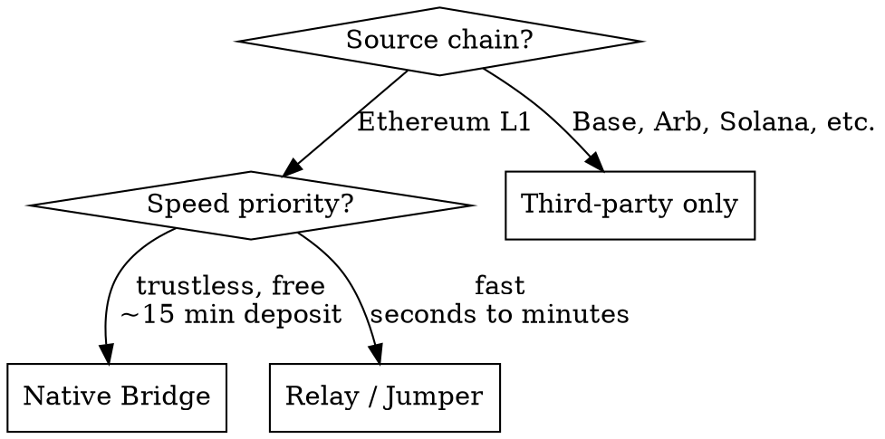

# Bridging to Abstract

Abstract supports a native Ethereum bridge and six third-party bridge providers for moving assets from other chains. This skill covers bridge selection, timing, costs, and programmatic bridge quotes.

## Operating Rules

- Identify the user's source chain and asset before recommending a bridge.
- For Ethereum → Abstract, recommend the native bridge for trustlessness or Relay for speed.
- For non-Ethereum chains (Base, Arbitrum, Solana, etc.), third-party bridges are the only option.
- Verify funds arrived via `agw wallet balances` after bridging.
- Read [references/native-bridge.md](./references/native-bridge.md) for native bridge architecture, contracts, and timing.
- Read [references/third-party-bridges.md](./references/third-party-bridges.md) for Relay API, Stargate, and other provider details.

## Bridge Selection



## Timing and Costs

| Route | Time | Cost |
|-------|------|------|
| Native L1→L2 deposit | ~15 minutes | Gas only (free protocol fee) |
| Native L2→L1 withdrawal | Up to 24 hours | Gas only (withdrawal delay) |
| Relay (any chain → Abstract) | Seconds to minutes | Small relay fee |
| Stargate | Minutes | LayerZero fee |
| Jumper/LI.FI | Minutes | Aggregated best route |

## Native Bridge

The native bridge moves ETH and ERC-20 tokens between Ethereum and Abstract. Uses ZKsync shared bridge architecture.

- **Deposits (L1→L2)**: ~15 minutes. Tokens locked on L1, minted on L2.
- **Withdrawals (L2→L1)**: Up to 24 hours. Two-step: initiate on L2, then `finalizeWithdrawal` on L1 after batch execution.
- **Portal UI**: `https://portal.mainnet.abs.xyz/bridge/` (mainnet), `https://portal.testnet.abs.xyz/bridge/` (testnet)

### Discover bridge contracts programmatically

```bash
curl -X POST https://api.mainnet.abs.xyz \
  -H 'Content-Type: application/json' \
  -d '{"jsonrpc":"2.0","method":"zks_getBridgeContracts","params":[],"id":1}'
```

Returns: `l1Erc20DefaultBridge`, `l2Erc20DefaultBridge`, `l1WethBridge`, `l2WethBridge`.

## Relay API (Programmatic Bridging)

Relay is the best option for programmatic cross-chain bridging — clean REST API, near-instant, 85+ chains.

### Get a quote

```bash
curl -X POST "https://api.relay.link/quote/v2" \
  -H "Content-Type: application/json" \
  -d '{
    "user": "<SENDER_ADDRESS>",
    "originChainId": 1,
    "destinationChainId": 2741,
    "originCurrency": "0x0000000000000000000000000000000000000000",
    "destinationCurrency": "0x0000000000000000000000000000000000000000",
    "amount": "1000000000000000000"
  }'
```

The response includes transaction steps to sign and submit. Abstract mainnet chain ID is `2741`, testnet is `11124`.

## Third-Party Bridges

| Provider | URL | Best For |
|----------|-----|----------|
| Relay | relay.link | Programmatic API, near-instant |
| Jumper | jumper.exchange | Multi-route aggregation, best price |
| Stargate | stargate.finance/bridge | Cross-L2 via LayerZero |
| Symbiosis | symbiosis.finance | Abstract-specific routes |
| thirdweb | thirdweb.com/bridge | SDK integration |
| deBridge | app.debridge.com | Intent-based cross-chain |

For non-Ethereum source chains, guide users to the web UI of their preferred bridge unless programmatic access is needed (use Relay API).

## Verification

After bridging, confirm funds arrived:

```bash
agw wallet balances --json '{"fields":["accountAddress","nativeBalance"]}'
```

For ERC-20 tokens:

```bash
agw wallet tokens list --json '{"pageSize":10,"fields":["items.symbol","items.tokenAddress","items.value"]}'
```

## Common Issues

| Problem | Cause | Resolution |
|---------|-------|------------|
| Deposit not showing | L1→L2 takes ~15 minutes | Wait and recheck balances |
| Withdrawal stuck | Batch not yet executed on L1 | Wait up to 24 hours; check `isWithdrawalFinalized` before calling `finalizeWithdrawal` |
| Bridge shows unsupported | Third-party may not support all tokens | Try a different bridge provider or use the native bridge |

## Escalation

- Route wallet balance queries to `reading-agw-wallet`.
- Route session issues to `authenticating-with-agw`.
