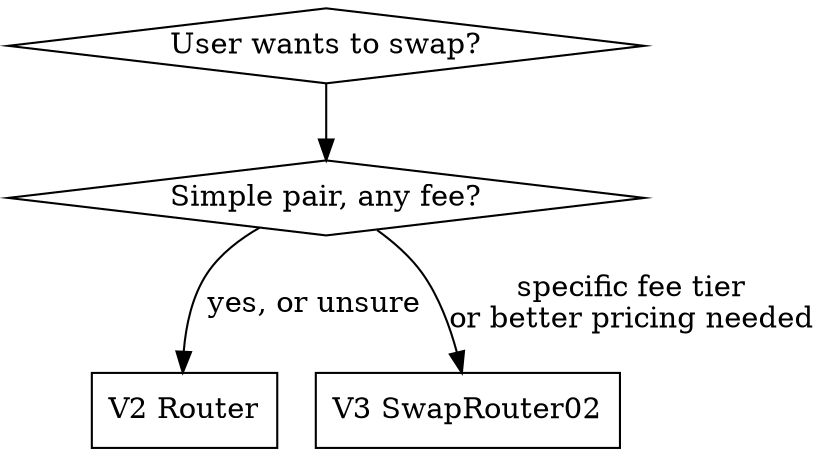

# Trading on Uniswap

Uniswap V2 and V3 are both deployed on Abstract mainnet and testnet. This skill covers swaps, quotes, and basic LP operations using AGW CLI commands.

## ABI Format

The AGW CLI requires full JSON ABI objects, not human-readable strings. Every `abi` array element must be an object with `type`, `name`, `inputs`, `outputs`, and `stateMutability` fields. Human-readable signatures in the references are for documentation — expand them to full JSON when constructing CLI commands.

## Operating Rules

- Check wallet balances with `agw wallet balances` or `agw wallet tokens list` before proposing any swap that depends on holdings.
- Default to V2 for simple swaps between common pairs. Prefer V3 when the user wants better pricing on deep-liquidity pairs or specifies a fee tier.
- Preview every swap, approval, and LP action with `--dry-run` before execution.
- Never hardcode `amountOutMin` to `"0"` — always derive from a quote minus slippage tolerance.
- Set deadlines to current time + 300-1200 seconds (5-20 minutes). Do not omit deadlines.
- Route generic session, wallet, and transaction safety questions back to `authenticating-with-agw`, `reading-agw-wallet`, and `executing-agw-transactions`.
- Read [references/contracts.md](./references/contracts.md) for all deployed addresses.
- Read [references/v2-entrypoints.md](./references/v2-entrypoints.md) for V2 router function signatures and swap examples.
- Read [references/v3-entrypoints.md](./references/v3-entrypoints.md) for V3 router, quoter, and position manager signatures.

## V2 vs V3 Decision



- **V2**: Simpler ABI, single fee tier per pair, `swapExactETHForTokens` handles WETH wrapping. Good default.
- **V3**: Multiple fee tiers (500 = 0.05%, 3000 = 0.3%, 10000 = 1%). Better capital efficiency. Requires fee tier selection. **Deadline is NOT in the swap struct** — wrap the call in `multicall(uint256 deadline, bytes[] data)`.

## Common Tokens (Mainnet)

| Token | Address | Decimals |
|-------|---------|----------|
| WETH | `0x3439153EB7AF838Ad19d56E1571FBD09333C2809` | 18 |
| USDC | `0x84A71ccD554Cc1b02749b35d22F684CC8ec987e1` | 6 |
| USDT | `0x0709F39376dEEe2A2dfC94A58EdEb2Eb9DF012bD` | 6 |

## Swap Workflow

1. Check balances: `agw wallet balances --json '{"fields":["accountAddress","nativeBalance"]}'`
2. Get a quote (read-only, no broadcast):
   - V2: `getAmountsOut(amountIn, path)` via `agw contract write --dry-run`
   - V3: `quoteExactInputSingle(params)` via QuoterV2 `agw contract write --dry-run`
3. Calculate `amountOutMin`: quote result * (1 - slippageTolerance). Use 0.5% for stablecoin pairs, 1-2% for volatile pairs.
4. Preview the swap: `agw contract write --json '{...}' --dry-run`
5. Execute only after user confirms: `agw contract write --json '{...}' --execute`
6. Verify: `agw wallet balances` or `agw wallet tokens list` to confirm receipt.

## Batching Approve + Swap

Abstract's native account abstraction enables atomic batching via `agw tx calls` (EIP-5792 sendCalls). This is the idiomatic approach — simpler than Permit2.

**`agw tx calls` accepts only `{to, data, value}` per call — raw hex-encoded calldata, NOT ABI-level `abi`/`functionName`/`args`.** Encode each call's calldata before passing it. The `approve` selector is `0x095ea7b3`; swap selectors vary by function.

```
agw tx calls --json '{
  "calls": [
    { "to": "<TOKEN>", "data": "0x095ea7b3<spender_padded><amount_padded>", "value": "0" },
    { "to": "<ROUTER>", "data": "<encoded_swap_calldata>", "value": "0" }
  ]
}' --dry-run
```

Both calls execute atomically — if either reverts, both revert. Always preview first. Approve only the exact swap amount, not `type(uint256).max`.

For readable command construction, use `agw contract write` for individual calls (supports ABI-level args) and reserve `agw tx calls` for when atomicity across multiple calls is required.

## DexScreener for Price Discovery

Use DexScreener as a fuzzy discovery surface when the exact pair or pool is unknown:

```bash
curl -Ls 'https://api.dexscreener.com/latest/dex/search/?q=<token-symbol>%20abstract' \
  | jq '.pairs[:5] | map(select(.chainId=="abstract")) | map({dexId, base:.baseToken.symbol, quote:.quoteToken.symbol, pairAddress, priceUsd})'
```

Do not treat DexScreener as authoritative for pair existence. Confirm on-chain via factory `getPair()` (V2) or pool lookup (V3).

## Gas Considerations

Abstract runs ZKsync VM. Gas costs can be 1.5-4x higher than native EraVM for EVM-compiled contracts. Include a ~2x buffer over estimated gas usage when setting gas limits manually.

## Error Handling

| Error | Cause | Fix |
|-------|-------|-----|
| `INSUFFICIENT_OUTPUT_AMOUNT` | Slippage exceeded | Increase `amountOutMin` tolerance or retry |
| `EXPIRED` | Deadline passed | Use a fresh deadline |
| `TRANSFER_FROM_FAILED` | Insufficient allowance or balance | Check approval and balance |
| `INSUFFICIENT_LIQUIDITY` | Pool has no liquidity for this pair | Try a different pair route or DEX |

## Escalation

- Route to `executing-agw-transactions` for general transaction safety and preview-first discipline.
- Route to `reading-agw-wallet` for balance and token inventory queries.
- Route to `trading-on-aborean` if the user mentions Aborean-specific pools, veABX, or gauge voting.
